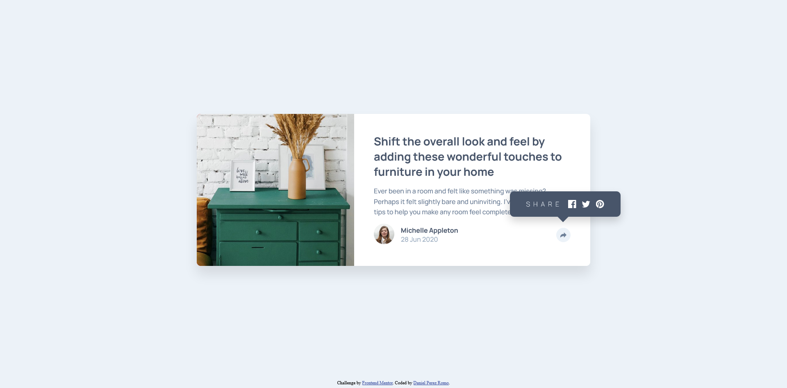

# Frontend Mentor - Article preview component solution

This is a solution to the [Article preview component challenge on Frontend Mentor](https://www.frontendmentor.io/challenges/article-preview-component-dYBN_pYFT). Frontend Mentor challenges help you improve your coding skills by building realistic projects. 

## Table of contents

- [Overview](#overview)
  - [The challenge](#the-challenge)
  - [Screenshot](#screenshot)
  - [Links](#links)
- [My process](#my-process)
  - [Built with](#built-with)
  - [What I learned](#what-i-learned)
  - [Continued development](#continued-development)
  - [Useful resources](#useful-resources)
- [Author](#author)

**Note: Delete this note and update the table of contents based on what sections you keep.**

## Overview

### The challenge

Users should be able to:

- View the optimal layout for the component depending on their device's screen size
- See the social media share links when they click the share icon

### Screenshot

### Links

- Solution URL: [https://www.frontendmentor.io/solutions/article-preview-component-7wgrwgVJda](https://www.frontendmentor.io/solutions/article-preview-component-7wgrwgVJda)
- Live Site URL: [https://daniel77apr.github.io/Frontend-Mentor-Article-preview-component/](https://daniel77apr.github.io/Frontend-Mentor-Article-preview-component/)

## My process

### Built with

- Semantic HTML5 markup
- CSS custom properties
- Flexbox
- JavaScript DOM Manipulation

### What I learned

This project turned out to be specially challenging for different reasons, so it was a good excercise that allowed me to learn new things such as: 

- svg tag
- How z-index really works
- Scale, translate and rotate properties
- setTimeout() method

Each of these concepts are better explained in the links that I included in the [Useful resources](#useful-resources) section.

### Continued development

For me at leat, CSS has proven to be as difficult as JavaScript, if not more. This language is hard to master as there are many implications that affect the layout of a website, which often depends on the combination of the properties and values of different elements, and not on their individual properties and values as separate things. This results in unpredictable behaviors and some frustrations, which I think may be reduced by learning more about best practices, good workflows, relative and absolute units, in depth aspects of flexbox and CSS grid, but more importantly, with a lot of practice.

### Useful resources

- [Insertar SVG en web y cambiar su color al pasar mouse con CSS](https://www.youtube.com/watch?v=50uLV6ZLHaw&t=125s&ab_channel=VentaHostingyDise%C3%B1odeP%C3%A1ginasWeb) - So apparently, I've been making a noob mistake by adding svg icons inside img elements. Now I know that there is a dedicated svg tag and can now modify these icons with CSS.
- [CSS: 4 Reasons Your Z-Index Isn't Working](https://www.youtube.com/watch?v=qYi-OLf5q5g&ab_channel=CoderCoder) - With this video you can't go wrong if your braking your head over z-index problems.
- [CSS Transform Is Dead! Use This Instead](https://www.youtube.com/watch?v=416MT-VmJdI&ab_channel=WebDevSimplified) - I didn't know about these new properties that you can use instead of or in addition to the transform property, which certainly has its applications.
- [CSS width & height, object-fit, overflow, and CSS units (ems, rems, vw, vmin, fr, ch, and more)](https://www.youtube.com/watch?v=hyAeX0p-uIA&ab_channel=Webflow) - This is more of a general overview that I found helpful when working in CSS. It has a high production value and it teaches the concepts perfectly.
- [JavaScript Wait – How to Sleep N Seconds in JS with .setTimeout()](https://www.freecodecamp.org/news/javascript-wait-how-to-sleep-n-seconds-in-js-with-settimeout/) - This article was a lifesaver when trying to prevent some JavaScript functions to interfere with CSS transitions or even with other functions. This is the first time I needed the setTimeout() method, but I suspect it won't be the last.

## Author

- GitHub - [Daniel77apr](https://github.com/Daniel77apr)
- Frontend Mentor - [@Daniel77apr](https://www.frontendmentor.io/profile/Daniel77apr)
